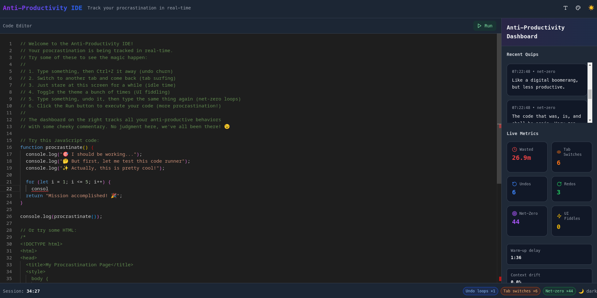
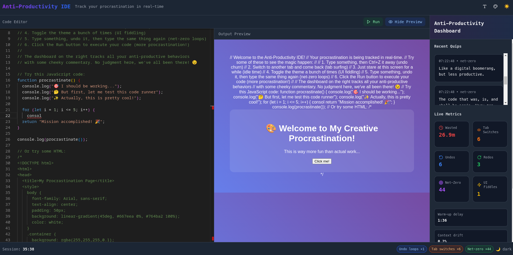
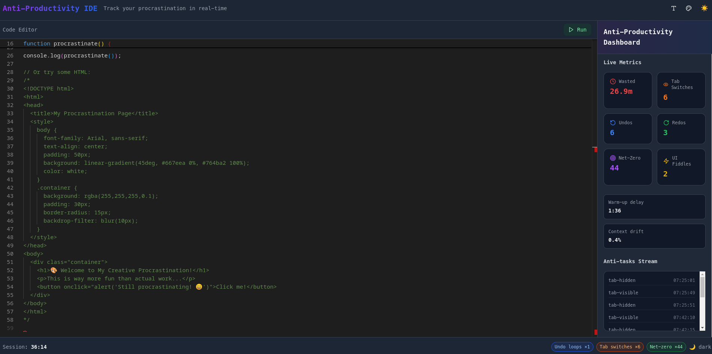

# [anti-productivity IDE] 🎯


## Basic Details
### Team Name: [404]


### Team Members
- Team Lead: [Jasil Faras] - [SCMS School of engineeering and technology]
- Member 2: [Krishna Priya] - [SCMS School of engineeering and technology]

### Project Description
A gloriously unserious single‑page React playground that treats procrastination like a feature, not a bug. It packs the Monaco Editor—the same code engine behind VS Code—and actually runs code in the browser for instant “just-one-more-try” dopamine hits.

Idle for a moment? Snarky anti‑motivation quotes pop in to lovingly derail momentum.

Hammer undo/redo? Every wobble is tracked and tallied like a sport.

Flip between tabs? The Page Visibility API spots every focus hop and logs it without judgment.

### The Problem (that doesn't exist)
Coders are expected to be productive, but what about those legendary moments of procrastination? This app celebrates the art of doing nothing (and undoing everything).

### The Solution (that nobody asked for)
Instead of nudging users to do more, Procrastinator IDE tracks undo churn, UI fiddling, tab switching, and idle time making these “failures” into entertaining achievements with memes, stats, and cheeky commentary.

## Technical Details
### Technologies/Components Used
For Software:
- Languages: TypeScript, JavaScript
- Frameworks: React, Vite
- Libraries: @monaco-editor/react, monaco-editor, Tailwind CSS
- Tools: LocalStorage, Page Visibility API


### Implementation
For Software:
# Installation
```bash
npm install
```

# Run
```bash
npm run dev
```

### DEMO
https://sprightly-sunburst-5a114b.netlify.app/

### Project Documentation

# Screenshots

*Monaco Editor with witty banner*


*Anti-Productivity Dashboard showing live stats*


*Status bar with animated chips for undo/redo and idle streaks*


## Team Contributions
- Krishna:App architecture, tracking logic,
- Jasil: UI design, Monaco integration, dashboard


---
Made with ❤️ at TinkerHub Useless Projects 


